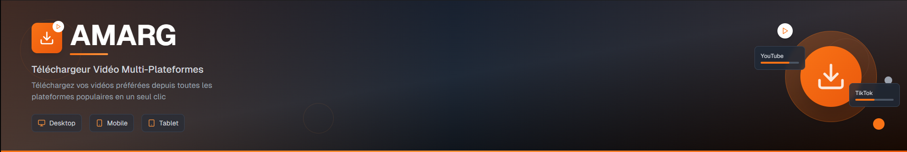
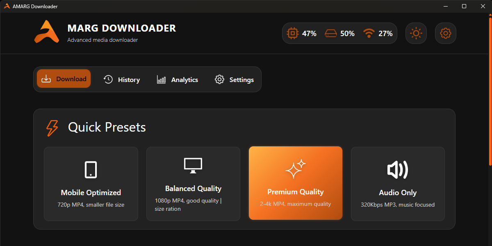

<div align="center">


# AMARG Downloader

[](https://github.com/BUGA-M/AmargDownloder/stargazers)
[](https://github.com/BUGA-M/AmargDownloder/network/members)
[](https://tauri.app/)
[](https://github.com/yt-dlp/yt-dlp)
[](https://ffmpeg.org/)



</div>


---

## 📋 About

A lightweight, fast, and user-friendly desktop application for downloading videos and audio from various online platforms including YouTube, TikTok, Instagram, and more.

## 🚀 Features

### Core Functionality
- **Multi-Platform Support**: Download from YouTube, TikTok, Instagram, and other popular platforms
- **Dual Format Support**: Download videos in MP4 format or extract audio as MP3
- **Batch Downloads**: Download multiple videos simultaneously with configurable concurrency
- **Smart Quality Selection**: Automatically selects the best available quality
- **Custom Output Names**: Rename your downloads with custom filenames
- **Flexible Output Paths**: Choose your preferred download location

### User Experience
- **Modern UI**: Clean, intuitive interface with light/dark theme support
- **Quick Presets**: Pre-configured settings for different use cases:
  - Mobile Optimized (720p MP4)
  - Balanced Quality (1080p MP4)
  - Premium Quality (2-4K MP4)
  - Audio Only (320Kbps MP3)
- **Real-time Progress**: Live download progress tracking
- **System Tray Integration**: Minimize to system tray for background operation
- **Auto-start Support**: Optional startup with Windows
- **Download History**: Track all your downloads with date organization

### Advanced Features
- **Concurrent Downloads**: Download multiple files simultaneously (configurable limit)
- **Error Handling**: Robust error handling with retry mechanisms
- **Network Optimization**: Configurable concurrent fragments for faster downloads
- **File Management**: Integrated file explorer integration
- **Splash Screen**: Professional startup experience

## 🛠️ Technology Stack

- **Frontend**: TypeScript, HTML5, CSS3
- **Backend**: Rust with Tauri framework
- **Download Engine**: yt-dlp with FFmpeg integration
- **UI Framework**: Custom CSS with modern design principles
- **Build System**: Vite for frontend bundling

## 📋 System Requirements

- **Operating System**: Windows 10/11 (64-bit)
- **Memory**: 4GB RAM minimum, 8GB recommended
- **Storage**: 100MB for application + space for downloads
- **Network**: Internet connection required

## 🚀 Installation

### ⚡ Quick Setup

<details>
<summary><b> Installation via NSIS Installer</b></summary>
<br>

```powershell
# Create destination folder
mkdir -p AmargDownloaderBeta

# Download the NSIS installer
Invoke-WebRequest -Uri "https://github.com/BUGA-M/AmargDownloder-GUI/releases/download/v1.0.0/Amarg_Downloader_setup.exe" -OutFile "AmargDownloaderBeta\AMARG-Setup-NSIS.exe"

# Run the installer
.\AmargDownloaderBeta\AMARG-Setup-NSIS.exe
```
</details>

<details>
<summary><b> Installation via MSI Installer</b></summary>
<br>

```powershell
# Create destination folder
mkdir -p AmargDownloaderBeta

# Download the MSI installer
Invoke-WebRequest -Uri "https://github.com/BUGA-M/AmargDownloder-GUI/releases/download/v1.0.0/Amarg_Downloader.msi" -OutFile "AmargDownloaderBeta\AMARG-Setup.msi"

# Run the MSI installer
.\AmargDownloaderBeta\AMARG-Setup.msi
```
</details>

### 🧑‍💻 Development Setup

```bash
# Clone the repository
git clone https://github.com/BUGA-M/AmargDownloder-GUI.git
cd AmargDownloder-GUI

# Install dependencies
npm install

# Navigate to resources directory
cd src-tauri/resources

# Download FFmpeg executable
Invoke-WebRequest -Uri "https://github.com/BUGA-M/AmargDownloder-GUI/releases/download/resources/ffmpeg.exe" -OutFile "ffmpeg.exe"

# Download yt-dlp executable
Invoke-WebRequest -Uri "https://github.com/BUGA-M/AmargDownloder-GUI/releases/download/resources/yt-dlp.exe" -OutFile "yt-dlp.exe"

# Go back to project root
cd ../..

# Install Rust dependencies
cd src-tauri
cargo build

# Run in development mode
npm run tauri dev

# Build for production
npm run tauri build
```

## 🎯 Usage

### Quick Start
1. **Launch the Application**: Open AMARG Downloader from your desktop or start menu
2. **Paste URL**: Copy and paste a video URL into the input field
3. **Select Format**: Choose between MP4 (video) or MP3 (audio only)
4. **Configure Options**: Set quality, output name, and download location
5. **Download**: Click "Start Bash Download" to begin

### Batch Downloads
1. Add multiple URLs by pasting and clicking the "+" button
2. Configure global settings for all downloads
3. Monitor progress in real-time
4. Files are automatically organized in your chosen output folder

### Settings & Customization
- **Output Folder**: Choose where downloads are saved (default: Downloads/AMARG)
- **Auto-start**: Enable/disable startup with Windows
- **Theme**: Switch between light and dark modes
- **Download Limits**: Configure maximum concurrent downloads

## 📁 File Structure

```
AMARG Downloader/
├── src/                    # Frontend source code
│   ├── assets/            # Images and icons
│   ├── components/        # UI components
│   ├── utils/            # Utility functions
│   ├── main.ts           # Main TypeScript entry
│   └── styles.css        # Application styles
├── src-tauri/             # Rust backend
│   ├── src/
│   │   ├── downloads.rs   # Download management
│   │   ├── info_urls.rs   # URL processing & metadata
│   │   └── lib.rs         # Main application logic
│   ├── resources/         # Bundled binaries
│   │   ├── yt-dlp.exe    # Download engine
│   │   └── ffmpeg.exe    # Media processing
│   └── tauri.conf.json   # Tauri configuration
├── dist/                  # Built frontend files
└── package.json          # Node.js dependencies
```

## 🔧 Configuration

### Download Settings
- **Concurrent Downloads**: 1-10 simultaneous downloads
- **Fragment Concurrency**: Network optimization (default: 4)
- **Error Handling**: Automatic retry on network issues
- **File Naming**: Custom templates and sanitization

### Application Settings
- **Startup Behavior**: Normal window or minimized to tray
- **Theme Preference**: Light/dark mode persistence
- **Default Paths**: Customizable download directories
- **History Management**: Automatic download tracking

## 🐛 Troubleshooting

### Common Issues

**Downloads Fail with "Server Issue"**
- The source server is temporarily unavailable
- Try again later or check if the URL is still valid

**"URL Not Found or Expired"**
- The video may have been deleted or made private
- Verify the URL is correct and accessible

**Application Won't Start**
- Ensure Windows Defender/antivirus isn't blocking the application
- Run as administrator if necessary
- Check Windows Event Viewer for detailed error logs

**Slow Download Speeds**
- Adjust concurrent fragments setting (try 2-8)
- Check your internet connection
- Some platforms may have rate limiting

### Log Files
Application logs are stored in:
```
%APPDATA%/com.amarg.downloader/
├── temp_DWL.json         # Temporary download queue
├── search_history.json   # Download history
└── single_download.json  # Single download history
```

## 🤝 Contributing

We welcome contributions! Please see our [Contributing Guidelines](CONTRIBUTING.md) for details.

### Development Workflow
1. Fork the repository
2. Create a feature branch (`git checkout -b feature/amazing-feature`)
3. Commit your changes (`git commit -m 'Add amazing feature'`)
4. Push to the branch (`git push origin feature/amazing-feature`)
5. Open a Pull Request

## 📄 License

This project is licensed under the MIT License - see the [LICENSE](LICENSE) file for details.

## 🙏 Acknowledgments

- **yt-dlp**: Powerful download engine
- **FFmpeg**: Media processing capabilities
- **Tauri**: Cross-platform desktop framework
- **Rust Community**: Amazing ecosystem and tools

## 📞 Support

- **Issues**: [GitHub Issues](../../issues)
- **Email**: ggxini@gmail.com
- **Documentation**: [Wiki](../../wiki)

## 🔄 Version History

### v0.1.0-beta (Current)
- Initial release
- Basic download functionality
- Multi-platform support
- Batch downloads
- System tray integration
- Download history tracking

---



**Made with ❤️ by BUGA**

*AMARG Downloader - Advanced Media Acquisition & Resource Gateway*
